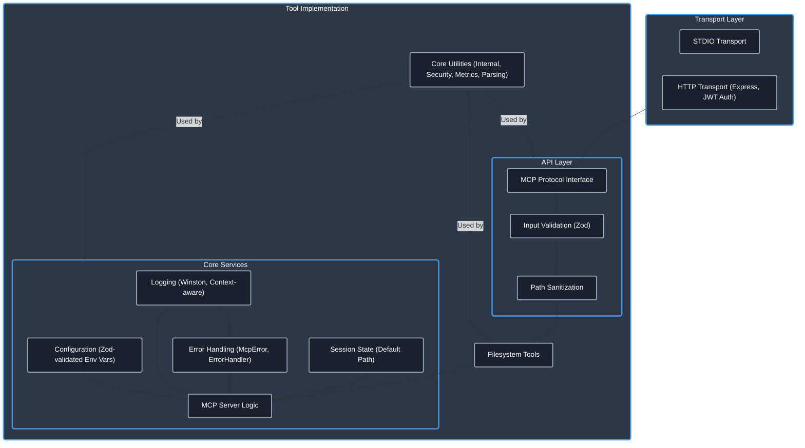

# Filesystem MCP Server

[](https://www.typescriptlang.org/)
[](https://modelcontextprotocol.io/)
[]()
[](https://opensource.org/licenses/Apache-2.0)
[]()
[](https://github.com/cyanheads/filesystem-mcp-server)

**Empower your AI agents with robust, platform-agnostic file system capabilities, now with STDIO & Streamable HTTP transport options.**

This [Model Context Protocol (MCP)](https://modelcontextprotocol.io/) server provides a secure and reliable interface for AI agents to interact with the local filesystem. It enables reading, writing, updating, and managing files and directories, backed by a production-ready TypeScript foundation featuring comprehensive logging, error handling, security measures, and now supporting both **STDIO and HTTP transports**.

## Table of Contents

- [Overview](#overview)
- [Features](#features)
- [Installation](#installation)
- [Configuration](#configuration)
- [Usage with MCP Clients](#usage-with-mcp-clients)
- [Available Tools](#available-tools)
- [Project Structure](#project-structure)
- [Development](#development)
- [License](#license)

## Overview

The Model Context Protocol (MCP) is a standard framework allowing AI models to securely interact with external tools and data sources (resources). This server implements the MCP standard to expose essential filesystem operations as tools, enabling AI agents to:

- Read and analyze file contents.
- Create, modify, or overwrite files.
- Manage directories and file paths.
- Perform targeted updates within files.

Built with TypeScript, the server emphasizes type safety, modularity, and robust error handling, making it suitable for reliable integration into AI workflows. It now supports both STDIO for direct process communication and HTTP for network-based interactions.

### Architecture

The server employs a layered architecture for clarity and maintainability:



- **Transport Layer**: Handles communication via STDIO or HTTP (with Express.js and JWT authentication).
- **API Layer**: Manages MCP communication, validates inputs using Zod, and sanitizes paths.
- **Core Services**: Oversees configuration (Zod-validated environment variables), context-aware logging, standardized error reporting, session state (like the default working directory), and the main MCP server instance.
- **Tool Implementation**: Contains the specific logic for each filesystem tool, leveraging a refactored set of shared utilities categorized into internal, security, metrics, and parsing modules.

## Features

- **Comprehensive File Operations**: Tools for reading, writing, listing, deleting, moving, and copying files and directories.
- **Targeted Updates**: `update_file` tool allows precise search-and-replace operations within files, supporting plain text and regex.
- **Session-Aware Path Management**: `set_filesystem_default` tool establishes a default working directory for resolving relative paths during a session.
- **Dual Transport Support**:
  - **STDIO**: For direct, efficient communication when run as a child process.
  - **HTTP**: For network-based interaction, featuring RESTful endpoints, Server-Sent Events (SSE) for streaming, and JWT-based authentication.
- **Security First**:
  - Built-in path sanitization prevents directory traversal attacks.
  - JWT authentication for HTTP transport.
  - Input validation with Zod.
- **Robust Foundation**: Includes production-grade utilities, now reorganized for better modularity:
  - **Internal Utilities**: Context-aware logging (Winston), standardized error handling (`McpError`, `ErrorHandler`), request context management.
  - **Security Utilities**: Input sanitization, rate limiting, UUID and prefixed ID generation.
  - **Metrics Utilities**: Token counting.
  - **Parsing Utilities**: Natural language date parsing, partial JSON parsing.
- **Enhanced Configuration**: Zod-validated environment variables for type-safe and reliable setup.
- **Type Safety**: Fully implemented in TypeScript for improved reliability and maintainability.

## Installation

### Steps

1.  **Clone the repository:**
    ```bash
    git clone https://github.com/cyanheads/filesystem-mcp-server.git
    cd filesystem-mcp-server
    ```
2.  **Install dependencies:**
    ```bash
    npm install
    ```
3.  **Build the project:**
    ```bash
    npm run build
    ```
    This compiles the TypeScript code to JavaScript in the `dist/` directory and makes the main script executable. The executable will be located at `dist/index.js`.

## Configuration

Configure the server using environment variables (a `.env` file is supported):

**Core Server Settings:**

- **`MCP_LOG_LEVEL`** (Optional): Minimum logging level (e.g., `debug`, `info`, `warn`, `error`). Defaults to `debug`.
- **`MCP_CONSOLE_LOG`** (Optional): Set to `true` to force console output regardless of TTY status. Essential for Docker containers where `docker logs` should show server output. Defaults to `false`.
- **`LOGS_DIR`** (Optional): Directory for log files. Defaults to `./logs` in the project root.
- **`NODE_ENV`** (Optional): Runtime environment (e.g., `development`, `production`). Defaults to `development`.

**Transport Settings:**

- **`MCP_TRANSPORT_TYPE`** (Optional): Communication transport (`stdio` or `http`). Defaults to `stdio`.
  - **If `http` is selected:**
    - **`MCP_HTTP_PORT`** (Optional): Port for the HTTP server. Defaults to `3010`.
    - **`MCP_HTTP_HOST`** (Optional): Host for the HTTP server. Defaults to `127.0.0.1`.
    - **`MCP_ALLOWED_ORIGINS`** (Optional): Comma-separated list of allowed CORS origins (e.g., `http://localhost:3000,https://example.com`).
    - **`MCP_AUTH_SECRET_KEY`** (Required for HTTP Auth): A secure secret key (at least 32 characters long) for JWT authentication. **CRITICAL for production.**

**Filesystem Security:**

- **`FS_BASE_DIRECTORY`** (Optional): Defines the root directory for all filesystem operations. This can be an **absolute path** or a **path relative to the project root** (e.g., `./data_sandbox`). If set, the server's tools will be restricted to accessing files and directories only within this specified (and resolved absolute) path and its subdirectories. This is a crucial security feature to prevent unintended access to other parts of the filesystem. If not set (which is not recommended for production environments), a warning will be logged, and operations will not be restricted.

**LLM & API Integration (Optional):**

- **`OPENROUTER_APP_URL`**: Your application's URL for OpenRouter.
- **`OPENROUTER_APP_NAME`**: Your application's name for OpenRouter. Defaults to `MCP_SERVER_NAME`.
- **`OPENROUTER_API_KEY`**: API key for OpenRouter services.
- **`LLM_DEFAULT_MODEL`**: Default LLM model to use (e.g., `google/gemini-2.5-flash-preview-05-20`).
- **`LLM_DEFAULT_TEMPERATURE`**, **`LLM_DEFAULT_TOP_P`**, **`LLM_DEFAULT_MAX_TOKENS`**, **`LLM_DEFAULT_TOP_K`**, **`LLM_DEFAULT_MIN_P`**: Default parameters for LLM calls.
- **`GEMINI_API_KEY`**: API key for Google Gemini services.

**OAuth Proxy Integration (Optional, for advanced scenarios):**

- **`OAUTH_PROXY_AUTHORIZATION_URL`**, **`OAUTH_PROXY_TOKEN_URL`**, **`OAUTH_PROXY_REVOCATION_URL`**, **`OAUTH_PROXY_ISSUER_URL`**, **`OAUTH_PROXY_SERVICE_DOCUMENTATION_URL`**, **`OAUTH_PROXY_DEFAULT_CLIENT_REDIRECT_URIS`**: Configuration for an OAuth proxy.

Refer to `src/config/index.ts` and the `.clinerules` file for the complete list and Zod schema definitions.

## Docker

Run the server in a Docker container with HTTP transport:

```bash
docker run -d --name mcp-fs-server \
  -p 3010:3010 \
  -e MCP_TRANSPORT_TYPE=http \
  -e MCP_HTTP_PORT=3010 \
  -e MCP_HTTP_HOST=0.0.0.0 \
  -e MCP_AUTH_SECRET_KEY="your-secret-key-at-least-32-characters" \
  -e MCP_LOG_LEVEL=info \
  -e MCP_CONSOLE_LOG=true \
  -v /path/to/data:/data \
  -e FS_BASE_DIRECTORY=/data \
  ghcr.io/yasien-c/filesystem-mcp-server:latest \
  node dist/index.js
```

View logs:
```bash
docker logs -f mcp-fs-server
```

## Usage with MCP Clients

To allow an MCP client (like an AI assistant) to use this server:

1.  **Run the Server:** Start the server from your terminal:
    ```bash
    node dist/index.js
    # Or if you are in the project root:
    # npm start
    ```
2.  **Configure the Client:** Add the server to your MCP client's configuration. The exact method depends on the client.

    **For STDIO Transport (Default):**
    Typically involves specifying:

    - **Command:** `node`
    - **Arguments:** The absolute path to the built server executable (e.g., `/path/to/filesystem-mcp-server/dist/index.js`).
    - **Environment Variables (Optional):** Set any required environment variables from the [Configuration](#configuration) section.

    **Example MCP Settings for STDIO (Conceptual):**

    ```json
    {
      "mcpServers": {
        "filesystem_stdio": {
          "command": "node",
          "args": ["/path/to/filesystem-mcp-server/dist/index.js"],
          "env": {
            "MCP_LOG_LEVEL": "debug"
            // Other relevant env vars
          },
          "disabled": false,
          "autoApprove": []
        }
      }
    }
    ```

    **For HTTP Transport:**
    The client will need to know the server's URL (e.g., `http://localhost:3010`) and how to authenticate (e.g., providing a JWT Bearer token if `MCP_AUTH_SECRET_KEY` is set). Refer to your MCP client's documentation for HTTP server configuration.

    **Generating a JWT Token:**

    When `MCP_AUTH_SECRET_KEY` is set, clients must provide a valid JWT token in the `Authorization` header. The token must include:
    - `cid` or `client_id` (required): Client identifier string
    - `scp` (array) or `scope` (space-separated string): Authorization scopes (optional)

    Generate a token using Node.js:
    ```javascript
    const jwt = require('jsonwebtoken');
    const token = jwt.sign(
      { 
        cid: 'my-client-id',
        scope: 'read write'
      }, 
      'your-secret-key-at-least-32-characters',
      { expiresIn: '24h' }
    );
    console.log(token);
    ```

    Or generate inside a running Docker container:
    ```bash
    docker exec <container-name> node -e "
    const jwt = require('jsonwebtoken');
    const token = jwt.sign(
      { cid: 'my-client', scope: 'read write' },
      process.env.MCP_AUTH_SECRET_KEY,
      { expiresIn: '7d' }
    );
    console.log(token);
    "
    ```

    Use the token in requests:
    ```bash
    curl -X POST http://localhost:3010/mcp \
      -H "Authorization: Bearer <your-jwt-token>" \
      -H "Content-Type: application/json" \
      -H "Accept: application/json, text/event-stream" \
      -d '{"jsonrpc":"2.0","method":"initialize","params":{...},"id":1}'
    ```

Once configured and running, the client will detect the server and its available tools.

## Available Tools

The server exposes the following tools for filesystem interaction:

| Tool                         | Description                                                                                                                                                                                                                                                                                                        |
| :--------------------------- | :----------------------------------------------------------------------------------------------------------------------------------------------------------------------------------------------------------------------------------------------------------------------------------------------------------------- |
| **`set_filesystem_default`** | Sets a default absolute path for the current session. Relative paths used in subsequent tool calls will be resolved against this default. Resets on server restart.                                                                                                                                                |
| **`read_file`**              | Reads the entire content of a specified file as UTF-8 text. Accepts relative (resolved against default) or absolute paths.                                                                                                                                                                                         |
| **`write_file`**             | Writes content to a specified file. Creates the file (and necessary parent directories) if it doesn't exist, or overwrites it if it does. Accepts relative or absolute paths.                                                                                                                                      |
| **`update_file`**            | Performs targeted search-and-replace operations within an existing file using an array of `{search, replace}` blocks. Ideal for localized changes. Supports plain text or regex search (`useRegex: true`) and replacing all occurrences (`replaceAll: true`). Accepts relative or absolute paths. File must exist. |
| **`list_files`**             | Lists files and directories within a specified path. Options include recursive listing (`includeNested: true`) and limiting the number of entries (`maxEntries`). Returns a formatted tree structure. Accepts relative or absolute paths.                                                                          |
| **`delete_file`**            | Permanently removes a specific file. Accepts relative or absolute paths.                                                                                                                                                                                                                                           |
| **`delete_directory`**       | Permanently removes a directory. Use `recursive: true` to remove non-empty directories and their contents (use with caution!). Accepts relative or absolute paths.                                                                                                                                                 |
| **`create_directory`**       | Creates a new directory at the specified path. By default (`create_parents: true`), it also creates any necessary parent directories. Accepts relative or absolute paths.                                                                                                                                          |
| **`move_path`**              | Moves or renames a file or directory from a source path to a destination path. Accepts relative or absolute paths for both.                                                                                                                                                                                        |
| **`copy_path`**              | Copies a file or directory from a source path to a destination path. For directories, it copies recursively by default (`recursive: true`). Accepts relative or absolute paths.                                                                                                                                    |

_Refer to the tool registration files (`src/mcp-server/tools/*/registration.ts`) for detailed input/output schemas (Zod/JSON Schema)._

## Project Structure

The codebase is organized for clarity and maintainability:

```
filesystem-mcp-server/
├── dist/                 # Compiled JavaScript output (after npm run build)
├── logs/                 # Log files (created at runtime)
├── node_modules/         # Project dependencies
├── src/                  # TypeScript source code
│   ├── config/           # Configuration loading (index.ts)
│   ├── mcp-server/       # Core MCP server logic
│   │   ├── server.ts     # Server initialization, tool registration, transport handling
│   │   ├── state.ts      # Session state management (e.g., default path)
│   │   ├── tools/        # Individual tool implementations (one subdir per tool)
│   │   │   ├── readFile/
│   │   │   │   ├── index.ts
│   │   │   │   ├── readFileLogic.ts
│   │   │   │   └── registration.ts
│   │   │   └── ...       # Other tools (writeFile, updateFile, etc.)
│   │   └── transports/   # Communication transport implementations
│   │       ├── authentication/ # Auth middleware for HTTP
│   │       │   └── authMiddleware.ts
│   │       ├── httpTransport.ts
│   │       └── stdioTransport.ts
│   ├── types-global/     # Shared TypeScript types and interfaces
│   │   ├── errors.ts     # Custom error classes and codes (McpError, BaseErrorCode)
│   │   ├── mcp.ts        # MCP related types
│   │   └── tool.ts       # Tool definition types
│   ├── utils/            # Reusable utility modules, categorized
│   │   ├── internal/     # Core internal utilities (errorHandler, logger, requestContext)
│   │   ├── metrics/      # Metrics-related utilities (tokenCounter)
│   │   ├── parsing/      # Parsing utilities (dateParser, jsonParser)
│   │   ├── security/     # Security-related utilities (idGenerator, rateLimiter, sanitization)
│   │   └── index.ts      # Barrel export for all utilities
│   └── index.ts          # Main application entry point
├── .clinerules           # Cheatsheet for LLM assistants
├── .dockerignore
├── Dockerfile
├── LICENSE
├── mcp.json              # MCP server manifest (generated by SDK or manually)
├── package.json
├── package-lock.json
├── README.md             # This file
├── repomix.config.json
├── smithery.yaml         # Smithery configuration (if used)
└── tsconfig.json         # TypeScript compiler options
```

For a live, detailed view of the current structure, run: `npm run tree` (This script might need to be updated if `src/scripts/tree.ts` was part of the changes).

> **Developer Note:** This repository includes a [.clinerules](.clinerules) file. This cheat sheet provides your LLM coding assistant with essential context about codebase patterns, file locations, and usage examples. Keep it updated as the server evolves!

## License

This project is licensed under the Apache License 2.0. See the [LICENSE](LICENSE) file for details.

---

<div align="center">
Built with ❤️ and the <a href="https://modelcontextprotocol.io/">Model Context Protocol</a>
</div>
